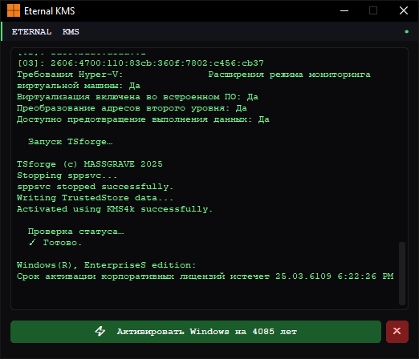
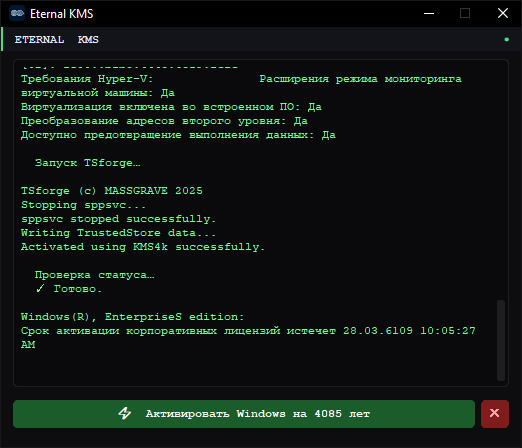

# Eternal KMS: Windows Activator

## ⚡ Простой и удобный активатор Windows на 4085 лет

**Eternal KMS** — десктопное приложение для Windows с минималистичным тёмным интерфейсом, позволяющее активировать Windows одним нажатием. Построено на базе [TSforge](https://github.com/asdcorp/TSforge) и [CustomTkinter](https://github.com/TomSchimansky/CustomTkinter).

---

## ✨ Возможности:

- Активация Windows на **4085 лет** через KMS
- Автоматическая проверка статуса лицензии после активации
- Динамический индикатор состояния в интерфейсе
- Встроенная консоль с выводом системной информации
- Минималистичный тёмный интерфейс в стиле терминала

---

## ⚙️ Установка:

### Вариант 1 — готовый `.exe` (рекомендуется):

1. Скачать последний релиз из раздела [Releases](https://github.com/frostbittenbull/Eternal-KMS/releases)
2. Запустить `EternalKMS.exe` от имени администратора

### Вариант 2 — из исходников:

```bash
git clone https://github.com/frostbittenbull/Eternal-KMS.git
cd Eternal-KMS
curl -L https://github.com/massgravel/TSforge/releases/download/1.1.1/TSforge-1.1.1.zip -o tsforge.zip
tar -xf tsforge.zip
del tsforge.zip
pip install -r requirements.txt
python main.py
```

> **Зависимости:** `customtkinter`
> **Требуется:** `TSforge.exe`, `LibTSforge.dll` и `TSforge.exe.config` в папке с приложением
> **Запускать от имени администратора**

---

## 🖼️ Скриншот:



---

## 🔐 Права администратора:

Для корректной активации приложение необходимо запускать с правами администратора.  
При запуске без прав — активация завершится ошибкой.

---

## 🛠️ Стек технологий:

- Python 3.x
- [TSforge](https://github.com/asdcorp/TSforge)
- [CustomTkinter](https://github.com/TomSchimansky/CustomTkinter)
